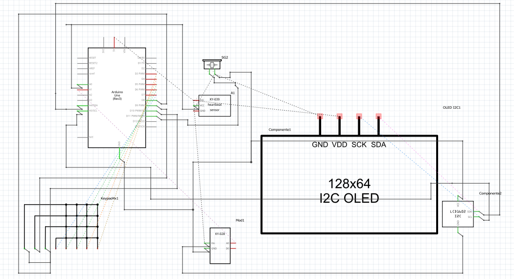
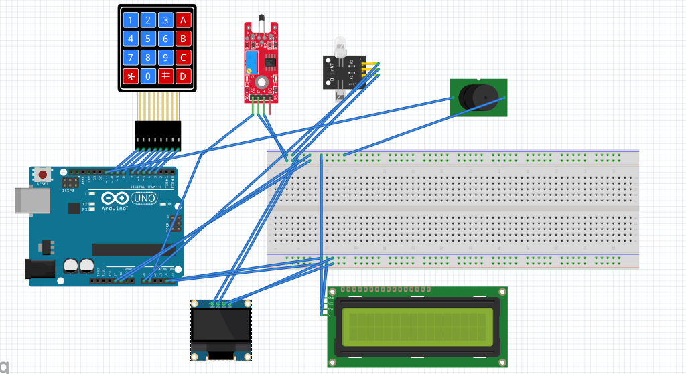

# MEDIDOR DE PULSO Y TEMPERATURA

**Integrantes del grupo:** Gentta Iván, Aguirre Christian, Aira Nicholas, Spataro Franco.\
**Docentes y materia:** Pedro Iriso - Matías Gagliardo.
                    **LABORATORIO DE COMPUTACIÓN I**

## Descripción general y funcionalidades
El grupo diseñó un sistema con interfaz de usuario diseñado en arduino, el cual se maneja mediante un teclado matricial 4x4 y una Pantalla LCD 16x2 con módulo I2C que permite al usuaio hacer lecturas medicas de temperatura(grados) y la medición de frecuencia cardiaca(BPM), y la activacion de un zumbador(Buzzer) para cortar el ritmo cardiaco a modo ilustrativo y un Oled que grafica el pulso.\
Se elaboró un prototipo de monitor básico, capaz de medir señales vitales y permite mostrar el resultado por pantalla, combinando lecturas analógicas de sensores, procesamiento digital de señales, y retroalimentación visual y sonora.\
El sistema comienza con un menú principal interactivo que muestra en el LCD distintas funciones (1-Iniciar sensor BPM, 2-Medir temperatura, 3-Beep 3 segudos, 0-Volver) la cuales se seleccionan mediante el keypad para que se realice el envío de datos al monitor serial para verificación y depuración de las lecturas.\
 1-Medicion frecuencia cardiaca (BPM): Utiliza un sensor analogico de pulso KY-039 y realiza una lectura analógica del sensor de pulso, detección de flancos ascendentes y cálculo del ritmo cardíaco en BPM.\
 2-Medicion de temperatura: Utiliza un sensor de temperatura KY-028 para capturar la información y sacar el promedio de 10 lecturas analogicas y su conversion a grados Celsius mediante un mapeo.\
 3-Beep: Simula En forma de chiste la detención del ritmo cardiaco mediante la emisión de un tono de de tres segundos.\
 En conjunto, el proyecto permite al usuario realizar mediciones básicas de salud y comprobar el funcionamiento del sistema de manera práctica y visual.\

## Requisitos funcionales cumplidos
**Control de Entradas y Salidas:** El sistema controla múltiples entradas y salidas, tanto digitales como analógicas:\
  -Entradas digitales: se utilizan las teclas del keypad 4x4, conectadas a los pines digitales 3 al 10, que permiten la interacción con el usuario para seleccionar funciones (medir BPM, medir temperatura, emitir sonido o apagar).\
  -Entradas analógicas: se emplean los pines A0 (sensor de BPM) y A1 (sensor de temperatura), los cuales permiten leer valores analógicos que luego son procesados.\
  -Salidas digitales: se controla el buzzer (pin 12) y el display LCD I2C, que muestran resultados o emiten alertas sonoras.\
**Contador de Flancos:** El sistema incorpora un contador de flancos dentro de la función medirBPM(). Allí se detectan los cambios en la señal analógica del sensor de pulso (BPM), simulando la detección de flancos ascendentes.\
**Control Lógico por Tiempo:** El programa utiliza varios temporizadores basados en la función millis() y en retardos (delay()) para manejar tiempos y comportamientos:\
En medirBPM() se usa millis() para calcular el tiempo entre pulsos (first = millis() - last_beat;) y para actualizar el LCD cada 3 segundos (if (millis() - lastPrint >= interval)).\
En otras funciones (iniciarSensor(), beepTresSegundos(), probarTemperatura()) se usan retardos controlados para mostrar mensajes o ejecutar tareas temporizadas.\
**Control Lógico por Máquina de Estados:** El sistema implementa una máquina de estados finita (FSM) utilizando un enum llamado Estado. Los estados principales son:\
MENU: estado inicial donde se muestran las opciones disponibles.\
SENSOR: estado en el que se mide el ritmo cardíaco (BPM).\
TEMP: estado en el que se mide la temperatura.\
Todas estas transiciones dependen de las entradas del usuario en el keypad. El flujo de control está gobernado por el valor de estadoActual, y el loop() ejecuta las funciones correspondientes a cada estado, de este modo, el comportamiento del sistema depende tanto del estado actual como de las entradas recibidas.

## Componentes utilizados
**Componente:** Arduino UNO\
**Descripción:** Microcontrolador principal, ejecuta el programa y coordina todos los periféricos.

**Componente:** Pantalla LCD 16x2 con módulo I2C y Oled 0.9 pulgadas\
**Descripción:** Display alfanumérico, muestra el menú, mensajes y resultados de las mediciones.

**Componente:** Teclado matricial 4x4\
**Descripción:** Módulo de entrada, permite la interacción del usuario mediante teclas numéricas y de control.

**Componente:** Sensor de pulso KY-039\
**Descripción:** Sensor analógico, detecta variaciones en la señal del pulso para calcular la frecuencia cardíaca.

**Componente:** Sensor de temperatura KY-028\
**Descripción:** Sensor analógico lineal, mide la temperatura corporal aproximada del usuario.

**Componente:** Buzzer\
**Descripción:** Elemento sonoro, emite tonos de alerta y señales sonoras.

**Componente:** Cables varios\
**Descripción:** Elementos de conexión, permiten interconectar todos los componentes del circuito.

## Esquema Eléctrico


## Diagrama de conexiónes



## Máquina de estados
```
╔════════════════════════════════════════════════════════════════════════╗
║                         ESTADO: MENU                                   ║
║────────────────────────────────────────────────────────────────────────║
║ - Muestra en el LCD:                                                   ║
║   "1) BPM 2) Temp"                                                     ║
║   "3) Beep 0)Off"                                                      ║
║                                                                        ║
║ - Espera una tecla del Keypad:                                         ║
║                                                                        ║
║   Tecla '1' → transición a ESTADO SENSOR                               ║
║        Acción: iniciarSensor()                                         ║
║                                                                        ║
║   Tecla '2' → transición a ESTADO TEMP                                 ║
║        Acción: probarTemperatura()                                     ║
║                                                                        ║
║   Tecla '3' → permanece en MENU                                        ║
║        Acción: beepTresSegundos()                                      ║
║                                                                        ║
║   Tecla '0' → se asegura que todo esté apagado                         ║
║        Acción: apagarSensor() (limpia y vuelve al menú)                ║
╚════════════════════════════════════════════════════════════════════════╝
                      │
                      │
         ┌────────────┴────────────────┐
         │                             │
         ▼                             ▼
╔═════════════════════════════════╗   ╔══════════════════════════════════╗
║        ESTADO: SENSOR (BPM)     ║   ║       ESTADO: TEMP (Temperatura) ║
║─────────────────────────────────║   ║──────────────────────────────────║
║ - Se activa el sensor KY-039     ║   ║ - Lee el sensor KY-028          ║
║   y comienza la medición de BPM. ║   ║ - Promedia 10 lecturas          ║
║                                  ║   ║ - Convierte valor a °C          ║
║ - Muestra BPM cada 3 segundos    ║   ║ - Muestra en LCD:               ║
║   si la señal es válida.         ║   ║   "Temp Prom: XX.X C"           ║
║                                  ║   ║ - Espera 3 seg y vuelve al MENU ║
║ - Hace sonar el buzzer brevemente║   ║                                  ║
║   con cada pulso detectado.      ║   ║                                  ║
║                                  ║   ║ Tecla '0' → transición a MENU   ║
║ Tecla '0' → transición a MENU    ║   ║   Acción: mostrarMenu()          ║
║   Acción: apagarSensor()         ║   ║                                  ║
╚═════════════════════════════════╝   ╚══════════════════════════════════╝
                      │                             │
                      └────────────┬────────────────┘
                                   ▼
                   ╔════════════════════════════════════════╗
                   ║       Retorna al ESTADO: MENU          ║
                   ║ (LCD vuelve a mostrar las opciones)    ║
                   ╚════════════════════════════════════════╝
```

## Instrucciones de uso
Al tener el medidor de pulso y temperatura conectado y con el código subido al Arduino se mostrara
por la pantalla LCD las distintas opciones y el botón correspondiente para activar sus funciones.

**Medición del ritmo cardiaco (BPM)**

1- Oprima el botón 1 de la botonera para empezar la medición.

2- Coloque el dedo indice entre el medidor infrarojo y el fototransistor.

3- Asegurese que el dispositivo medidor se encuentre dentro de la cubertura proporcionada para resguardarlo lo mas posible de la luz exterior para una mejor medición.

4- Mantenga el dedo quieto por 10 segundos para una lectura mas estable.

5- Lea por la pantalla LCD su ritmo cardiaco.

6- Oprima el botón 0 de la botonera para finalizar la lectura, o el botón 3 para un pequeño easter egg.


**Medición de temperatura**

1- Mantenga apretado de antemano entre 2 dedos el sensor de medición de temperatura por 10 segundos para una mejor lectura.

2- Oprima el botón 2 de la botonera para empezar la medición.

3- Lea por la pantalla LCD su temperatura.


## Imágenes o video demostrativo

## :receipt: Licencia

Este proyecto está licenciado bajo los términos de la **Licencia MIT**.
Podés ver el texto completo en el archivo [LICENSE](LICENSE).

## Creditos

Proyecto desarrollado como trabajo final de la materia Laboratorio de Computación I,
en la Universidad Nacional de San Martín UNSAM, año 2025.

Agradecimientos especiales:

A los creadores y fabricantes de los sensores y módulos utilizados:

· Arduino

· Sensores KY-028 KY-039 DHT11

· Display LCD

· Display Oled


A los programas utilizados:

· Fritzing

· Tinkercad

. Arduino ide

· Github

A la comunidad de código abierto por los ejemplos, librerías empleadas y las Datasheets consultadas.


